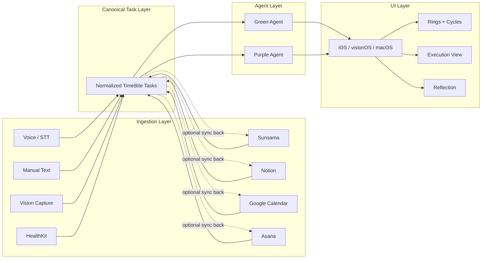

# TimeBite Platform

TimeBite is a **cycle-based time system** for modeling how time is actually spent across life categories — not just planned.

Built across:

- **iOS** (primary product surface)
- **visionOS** (spatial computing + torus visualization)
- **macOS** (future productivity + debugging interface)

---

## TL;DR

- **What:** A system that turns inputs and integrations into a canonical TimeBite task model
- **Core:** Inputs → Canonical Tasks → Agents → UI
- **Integrations:** Sunsama, Notion, Calendar, and Asana are adapters, not the source of truth
- **Status:** Active development + research monorepo

---

## Core concepts

### Ingestion layer

- Accepts inputs from:
  - voice / STT
  - manual text input
  - computer vision capture
  - HealthKit
  - external tools such as Sunsama, Notion, Google Calendar, and Asana

### Canonical task layer

- Source of truth for planning and execution
- Every input is normalized into one task shape before agents or UI touch it
- Integrations sync into and out of this layer instead of introducing their own task logic

### Agent layer

- Green Agent plans and classifies work
- Purple Agent executes, starts timers, and updates task state
- Agents operate on canonical TimeBite tasks, not vendor-specific objects

### TimeBite cycles (UI)

- User-facing representation of time distribution and execution state
- Includes:
  - category allocation
  - cycle bars and rings
  - execution state
  - reflection and feedback

### Constrained assistant (tight RAG)

- Not a general chatbot
- Only:
  - executes allowed UI actions
  - retrieves documentation

---

## Cycles dashboard (UI concept)

TimeBite surfaces time as a **structured system**, not just tasks.

### Daily cycles (example)

```text
[ Today ]

Engineering — 3h 20m ███████░░
Writing     — 1h 45m ████░░░░░
Health      — 0h 50m ██░░░░░░░
Admin       — 2h 10m █████░░░░
Personal    — 0h 30m █░░░░░░░░
```

---

## Repository layout (current)

What exists in this repo today (high level):

```text
timebite-platform/
├── apps/                    # Placeholder targets: iOS, visionOS, macOS
├── docs/                    # architecture, planning, and system docs
├── specs/                   # e.g. torus_environment.md
├── schemas/                 # Shared canonical JSON shapes
├── research/
│   └── auto_research/       # Research CLI, autoresearch package, outputs
├── README.md
└── .gitignore
```

---
### Target platform layout (planned)

Full monorepo layout (clients, backend, scripts). Expand to view.

<details>
<summary><strong>Full directory tree (planned)</strong></summary>

```text
timebite-platform/
│
├── apps/
│   ├── ios/
│   │   └── timebite-ios/
│   │       ├── App/
│   │       │   ├── TimeBiteApp.swift
│   │       │   ├── RootView.swift
│   │       │   ├── AppState.swift
│   │       │   └── Navigation/
│   │       │       ├── TabRouter.swift
│   │       │       └── RouteDefinitions.swift
│   │       │
│   │       ├── Features/
│   │       │   ├── cycles/
│   │       │   │   ├── Views/
│   │       │   │   │   ├── CyclesDashboardView.swift
│   │       │   │   │   ├── CycleRowView.swift
│   │       │   │   │   ├── CycleBarView.swift
│   │       │   │   │   ├── CycleScoreCard.swift
│   │       │   │   │   ├── RealityCheckView.swift
│   │       │   │   │   └── DailySummaryView.swift
│   │       │   │   ├── ViewModels/
│   │       │   │   │   ├── CyclesViewModel.swift
│   │       │   │   │   └── CycleComputation.swift
│   │       │   │   ├── Models/
│   │       │   │   │   ├── Cycle.swift
│   │       │   │   │   ├── Category.swift
│   │       │   │   │   └── CycleSnapshot.swift
│   │       │   │   └── Components/
│   │       │   │       ├── ProgressBar.swift
│   │       │   │       └── PercentageLabel.swift
│   │       │   │
│   │       │   ├── tasks/
│   │       │   │   ├── Models/
│   │       │   │   ├── Views/
│   │       │   │   └── ViewModels/
│   │       │   ├── planner/
│   │       │   ├── insights/
│   │       │   └── assistant/
│   │       │
│   │       ├── Services/
│   │       │   ├── API/
│   │       │   ├── Storage/
│   │       │   ├── Assistant/
│   │       │   └── Integrations/
│   │       │       ├── Sunsama/
│   │       │       ├── Notion/
│   │       │       ├── Calendar/
│   │       │       └── Asana/
│   │       │
│   │       └── Shared/
│   │
│   ├── visionos/
│   │   └── timebite-visionos/
│   │       ├── App/
│   │       │   ├── TimeBiteVisionApp.swift
│   │       │   └── SpatialRootView.swift
│   │       │
│   │       ├── Features/
│   │       │   ├── torus/
│   │       │   │   ├── Views/
│   │       │   │   │   ├── TorusView.swift
│   │       │   │   │   ├── Ring3DView.swift
│   │       │   │   │   └── SpatialCyclesView.swift
│   │       │   │   ├── Models/
│   │       │   │   └── ViewModels/
│   │       │   │
│   │       │   └── gestures/
│   │       │       ├── HandTrackingManager.swift
│   │       │       └── GestureRouter.swift
│   │       │
│   │       └── Shared/
│   │
│   ├── macos/
│   │   └── timebite-macos/
│   │       ├── App/
│   │       │   ├── TimeBiteMacApp.swift
│   │       │   └── DesktopRootView.swift
│   │       │
│   │       ├── Features/
│   │       │   ├── cycles/
│   │       │   ├── planner/
│   │       │   ├── insights/
│   │       │   └── debug/
│   │       │       ├── TelemetryView.swift
│   │       │       └── LogsViewer.swift
│   │       │
│   │       └── Services/
│   │
│   └── web/
│       └── timebite-web/
│
├── backend/
│   ├── services/
│   │   ├── ingestion/
│   │   │   ├── voice/
│   │   │   ├── text/
│   │   │   ├── vision/
│   │   │   └── healthkit/
│   │   │
│   │   ├── canonical/
│   │   │   ├── models.py
│   │   │   ├── normalization.py
│   │   │   ├── repository.py
│   │   │   └── sync_engine.py
│   │   │
│   │   ├── integrations/
│   │   │   ├── sunsama/
│   │   │   │   ├── client.py
│   │   │   │   └── mapper.py
│   │   │   ├── notion/
│   │   │   ├── google_calendar/
│   │   │   └── asana/
│   │   │
│   │   ├── cycles/
│   │   │   ├── cycle_engine.py
│   │   │   ├── scoring.py
│   │   │   └── snapshots.py
│   │   │
│   │   ├── agents/
│   │   │   ├── green_agent/
│   │   │   ├── purple_agent/
│   │   │   └── shared/
│   │   │
│   │   ├── assistant/
│   │   │   ├── orchestrator.py
│   │   │   ├── intent_classifier.py
│   │   │   ├── ui_action_whitelist.py
│   │   │   └── documentation_router.py
│   │   │
│   │   ├── retrieval/
│   │   │   ├── ingest_docs.py
│   │   │   ├── chunking.py
│   │   │   ├── embeddings.py
│   │   │   ├── vector_store.py
│   │   │   └── retriever.py
│   │   │
│   │   └── telemetry/
│   │
│   └── api/
│
├── shared/
├── docs/
├── research/
└── scripts/
```

</details>

---

## Architecture direction

TimeBite owns the canonical schema. External systems can enrich it, but they do not replace it.



---

## Documentation

- [System architecture](docs/system-architecture.md) — flow diagram and component relationships
- [Torus environment](specs/torus_environment.md) — state and actions sketch

---

## License

No `LICENSE` file is in the repo yet. Add one at the repo root (for example MIT or Apache-2.0) when you are ready to share terms.

---

## Security

Do not commit API keys, tokens, or production endpoints. Use a local `.env` (ignored by git) for secrets.
