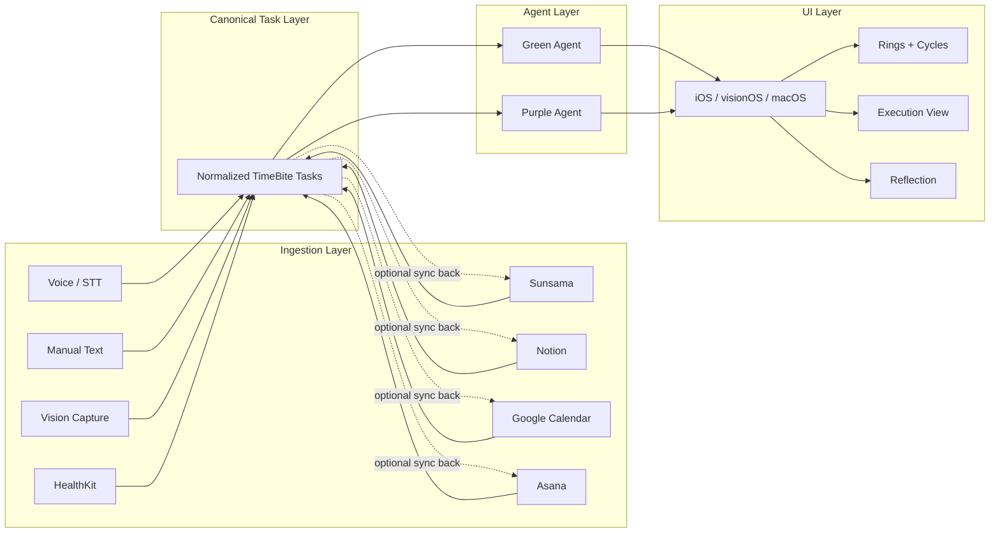

# TimeBite Platform

TimeBite is a **local-first focus operating system** that turns daily intent into execution truth through dynamic ring-based interfaces.

Built across:

- **iOS** (primary product surface)
- **visionOS** (spatial computing + torus visualization)
- **macOS** (future productivity + debugging interface)

---

## TL;DR

- **What:** Daily Intent → Ring Timer → Reflection → Dashboard (iPhone first)
- **Core:** Execution truth comes from durable session logs, not wishful checkmarks
- **Stance:** Local-first by default; backend sync is optional later
- **Status:** Active development + research monorepo

---

## Product vision

TimeBite helps ambitious knowledge workers intentionally allocate time, track execution, collaborate with AI agents, and visualize progress through ring-based interfaces.

Core iPhone loop:
- **Daily Intent planning**
- **Focus lanes**
- **Ring timer execution**
- **Reflection journaling**
- **Dashboard analytics**

See: `specs/vision.md`

## Why now

Knowledge work is increasingly:
- fragmented across tools and notifications,
- measured by “plans” rather than execution truth,
- accelerated by AI (but still constrained by attention and time budgets).

TimeBite focuses on what actually changes behavior: a calm daily plan, a single “now” surface, and feedback grounded in session evidence.

## Roadmap (Q2 2026)

Q2 2026 (Apr–Jun) focuses on an iPhone MVP that proves the core loop end-to-end:
- Foundations: local-first model + durable timer sessions
- MVP loop: Daily Intent + lanes + reflection + dashboard truth
- Beta polish: onboarding, stability, metrics, App Store readiness

See: `specs/roadmap-q2.md` and `specs/sprint-current.md`

## Tech stack (current)

- **iOS app:** Swift + SwiftUI, iPhone-first MVP in `apps/iOS/TimeBite.xcodeproj`
- **Backend prototypes:** Python modules in `backend/services/` (cycles, assistant, retrieval, telemetry)
- **Canonical schemas:** JSON in `schemas/`
- **Docs/specs:** Markdown in `specs/`, `product/`, `architecture/`, `docs/`

---

## Core concepts (platform-wide)

### Canonical day model (local-first)

- Source of truth for planning and execution lives on-device
- Structured as day plan → lanes → tasks → session logs (see `schemas/focus_os_schema.json`)

### Ring timer execution (execution truth)

- Sessions generate durable logs
- Dashboard aggregates from session logs, not just task state

### Constrained assistance (optional)

- AI is a workflow accelerator, not the product
- Suggestions are optional and user-confirmed

TimeBite surfaces time as a **structured system**, not just tasks.

### Daily cycles (example)

```text
[ Today ]

Engineering — 3h 20m ███████░░
Writing     — 1h 45m ████░░░░░
Health      — 0h 50m ██░░░░░░░
Admin       — 2h 10m █████░░░░
Personal    — 0h 30m █░░░░░░░░
```

---

## Repository layout (current)

What exists in this repo today (high level):

```text
timebite-platform/
├── apps/                    # Placeholder targets: iOS, visionOS, macOS
├── backend/                 # Prototype services (Python)
├── analytics/               # Event taxonomy + metrics (starter)
├── architecture/            # System design + interfaces (starter)
├── product/                 # PRDs + IA (starter)
├── docs/                    # operational docs (launch, brand, checklists)
├── specs/                   # requirements + roadmap
├── schemas/                 # Shared canonical JSON shapes
├── shared/                  # Shared code (starter)
├── research/
│   └── auto_research/       # Research CLI, autoresearch package, outputs
├── README.md
└── .gitignore
```

---
### Target platform layout (planned)

Full monorepo layout (clients, backend, scripts). Expand to view.

<details>
<summary><strong>Full directory tree (planned)</strong></summary>

```text
timebite-platform/
│
├── apps/
│   ├── ios/
│   │   └── timebite-ios/
│   │       ├── App/
│   │       │   ├── TimeBiteApp.swift
│   │       │   ├── RootView.swift
│   │       │   ├── AppState.swift
│   │       │   └── Navigation/
│   │       │       ├── TabRouter.swift
│   │       │       └── RouteDefinitions.swift
│   │       │
│   │       ├── Features/
│   │       │   ├── cycles/
│   │       │   │   ├── Views/
│   │       │   │   │   ├── CyclesDashboardView.swift
│   │       │   │   │   ├── CycleRowView.swift
│   │       │   │   │   ├── CycleBarView.swift
│   │       │   │   │   ├── CycleScoreCard.swift
│   │       │   │   │   ├── RealityCheckView.swift
│   │       │   │   │   └── DailySummaryView.swift
│   │       │   │   ├── ViewModels/
│   │       │   │   │   ├── CyclesViewModel.swift
│   │       │   │   │   └── CycleComputation.swift
│   │       │   │   ├── Models/
│   │       │   │   │   ├── Cycle.swift
│   │       │   │   │   ├── Category.swift
│   │       │   │   │   └── CycleSnapshot.swift
│   │       │   │   └── Components/
│   │       │   │       ├── ProgressBar.swift
│   │       │   │       └── PercentageLabel.swift
│   │       │   │
│   │       │   ├── tasks/
│   │       │   │   ├── Models/
│   │       │   │   ├── Views/
│   │       │   │   └── ViewModels/
│   │       │   ├── planner/
│   │       │   ├── insights/
│   │       │   └── assistant/
│   │       │
│   │       ├── Services/
│   │       │   ├── API/
│   │       │   ├── Storage/
│   │       │   ├── Assistant/
│   │       │   └── Integrations/
│   │       │       ├── Sunsama/
│   │       │       ├── Notion/
│   │       │       ├── Calendar/
│   │       │       └── Asana/
│   │       │
│   │       └── Shared/
│   │
│   ├── visionos/
│   │   └── timebite-visionos/
│   │       ├── App/
│   │       │   ├── TimeBiteVisionApp.swift
│   │       │   └── SpatialRootView.swift
│   │       │
│   │       ├── Features/
│   │       │   ├── torus/
│   │       │   │   ├── Views/
│   │       │   │   │   ├── TorusView.swift
│   │       │   │   │   ├── Ring3DView.swift
│   │       │   │   │   └── SpatialCyclesView.swift
│   │       │   │   ├── Models/
│   │       │   │   └── ViewModels/
│   │       │   │
│   │       │   └── gestures/
│   │       │       ├── HandTrackingManager.swift
│   │       │       └── GestureRouter.swift
│   │       │
│   │       └── Shared/
│   │
│   ├── macos/
│   │   └── timebite-macos/
│   │       ├── App/
│   │       │   ├── TimeBiteMacApp.swift
│   │       │   └── DesktopRootView.swift
│   │       │
│   │       ├── Features/
│   │       │   ├── cycles/
│   │       │   ├── planner/
│   │       │   ├── insights/
│   │       │   └── debug/
│   │       │       ├── TelemetryView.swift
│   │       │       └── LogsViewer.swift
│   │       │
│   │       └── Services/
│   │
│   └── web/
│       └── timebite-web/
│
├── backend/
│   ├── services/
│   │   ├── ingestion/
│   │   │   ├── voice/
│   │   │   ├── text/
│   │   │   ├── vision/
│   │   │   └── healthkit/
│   │   │
│   │   ├── canonical/
│   │   │   ├── models.py
│   │   │   ├── normalization.py
│   │   │   ├── repository.py
│   │   │   └── sync_engine.py
│   │   │
│   │   ├── integrations/
│   │   │   ├── sunsama/
│   │   │   │   ├── client.py
│   │   │   │   └── mapper.py
│   │   │   ├── notion/
│   │   │   ├── google_calendar/
│   │   │   └── asana/
│   │   │
│   │   ├── cycles/
│   │   │   ├── cycle_engine.py
│   │   │   ├── scoring.py
│   │   │   └── snapshots.py
│   │   │
│   │   ├── agents/
│   │   │   ├── green_agent/
│   │   │   ├── purple_agent/
│   │   │   └── shared/
│   │   │
│   │   ├── assistant/
│   │   │   ├── orchestrator.py
│   │   │   ├── intent_classifier.py
│   │   │   ├── ui_action_whitelist.py
│   │   │   └── documentation_router.py
│   │   │
│   │   ├── retrieval/
│   │   │   ├── ingest_docs.py
│   │   │   ├── chunking.py
│   │   │   ├── embeddings.py
│   │   │   ├── vector_store.py
│   │   │   └── retriever.py
│   │   │
│   │   └── telemetry/
│   │
│   └── api/
│
├── shared/
├── docs/
├── research/
└── scripts/
```

</details>

---

## Architecture direction

TimeBite owns the canonical schema. External systems can enrich it, but they do not replace it.



---

## Documentation

- Product and specs:
  - `specs/master-requirements.md`
  - `product/ia.md`
  - `product/prd-daily-intent.md`
  - `product/prd-ring-engine.md`
  - `product/prd-dashboard.md`
  - `product/prd-reflection.md`
- Architecture:
  - `architecture/system-design.md`
  - `architecture/data-models.md`
  - `docs/system-architecture.md` (legacy diagram)
- Launch:
  - `docs/launch-checklist.md`
  - `docs/app-store-launch.md`

---

## License

No `LICENSE` file is in the repo yet. Add one at the repo root (for example MIT or Apache-2.0) when you are ready to share terms.

---

## Security

Do not commit API keys, tokens, or production endpoints. Use a local `.env` (ignored by git) for secrets.
