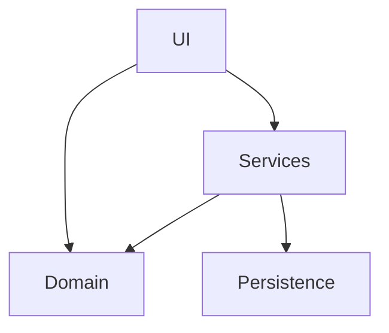

# Component Interfaces (iPhone MVP)

This document defines the minimal set of components and their responsibilities to keep the codebase scalable without premature abstraction.

## App layer (SwiftUI)

Screens (iPhone MVP):
- Dashboard
- Plan (Daily Intent)
- Timer (Ring execution)
- Reflection (entry + history-lite)

Screen responsibilities:
- render view state
- dispatch user intents to controllers
- no persistence logic inside views

## Domain layer (pure logic)

Recommended components:
- `PlannerEngine`
  - builds/validates a day plan
  - enforces invariants (single primary per lane)
- `RingEngine`
  - pure functions that compute progress ratios and ring states
- `AggregationEngine`
  - derives today/week summaries from logs + plan
- `TimeAllocationEngine`
  - derives weekly project cap usage (planned vs actual) from session logs

## Application services

Recommended services:
- `DayPlanRepository` (persistence boundary)
- `SessionLogRepository` (optional split from DayPlanRepository later)
- `ProjectRepository` (project buckets + weekly caps)
- `TimerController` (state machine + durability)
- `AnalyticsTracker` (event allowlist)

## Cross-platform considerations (later)

When watchOS/macOS/visionOS arrive:
- share domain engines as a Swift package under `shared/`
- keep UI per-platform
- keep repositories abstract so storage/sync can differ per platform

## Dependencies

Keep dependency direction one-way:

Rules:
- Domain has no dependencies on UI or persistence frameworks.
- Services adapt domain inputs/outputs to persistence and platform APIs.
