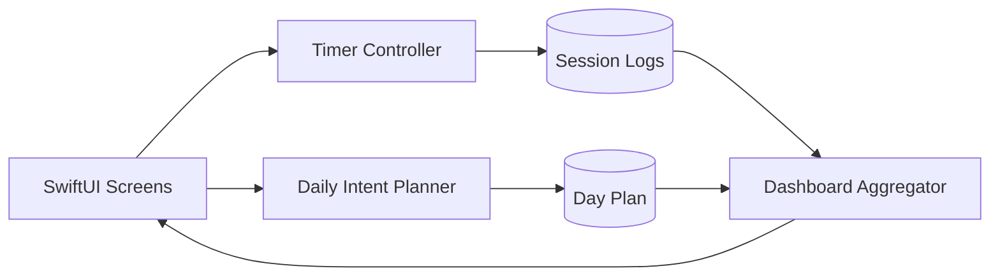

# System Design (Production iPhone-first)

This document describes the target system architecture for TimeBite as a long-term production codebase.

Guiding constraints:
- Preserve solo-founder velocity.
- Ship iPhone first.
- Stay local-first; treat backend sync as optional later.

## High-level architecture

TimeBite is a **local-first iOS app** with a small set of pure, testable engines:
- Planner (Daily Intent)
- Ring Engine (progress math)
- Timer + Session Logger (execution truth)
- Dashboard Aggregator (analytics views)
- (Optional) Assistant Suggestion Engine (constrained)

Backend services (when needed) provide:
- sync (opt-in)
- integrations (opt-in)
- model calls (opt-in)
- telemetry upload (privacy-preserving)

## Data flow (MVP)



## Proposed repository layout (additive)

Current repo already contains `apps/`, `backend/`, `docs/`, `schemas/`, `specs/`, and `research/`. Going forward:

```text
timebite-platform/
├── apps/                 # iOS, later watchOS/macOS/visionOS
├── backend/              # optional services (prototypes exist today)
├── shared/               # shared code + schemas
├── schemas/              # canonical JSON schemas
├── product/              # PRDs and IA
├── specs/                # requirements + roadmap
├── architecture/         # system and interface contracts
├── analytics/            # event taxonomy + metrics
└── docs/                 # launch + brand + operational docs
```

## Local-first strategy

### Principles
- The local store is the source of truth for the iPhone MVP.
- “Sync” is an adapter layered above the local store, not a rewrite.

### Persistence (starter options)
Pick one based on ergonomics + migration safety:
- SwiftData (fast iteration, watch for migration complexity)
- Core Data (mature, more boilerplate)
- SQLite + lightweight ORM (max control, more effort)

Regardless of choice, define:
- schema version
- migration strategy (forward-only)
- export format (debug + user ownership)

## Backend (later, optional)

When sync/integrations become necessary, prefer a small set of services:
- **Auth + Device Identity**
- **Sync API** (versioned, conflict-aware, opt-in)
- **Integrations** (Calendar, Notion, etc.) as adapters
- **Telemetry upload** (opt-in; privacy-preserving)

Existing `backend/services/` code can remain as research/prototype modules until product needs harden.

## Platform expansion

- watchOS: “Now” companion that consumes the same local canonical store (or synced subset later)
- macOS: planning/review power surface
- visionOS: ambient rings + deep focus experiences

