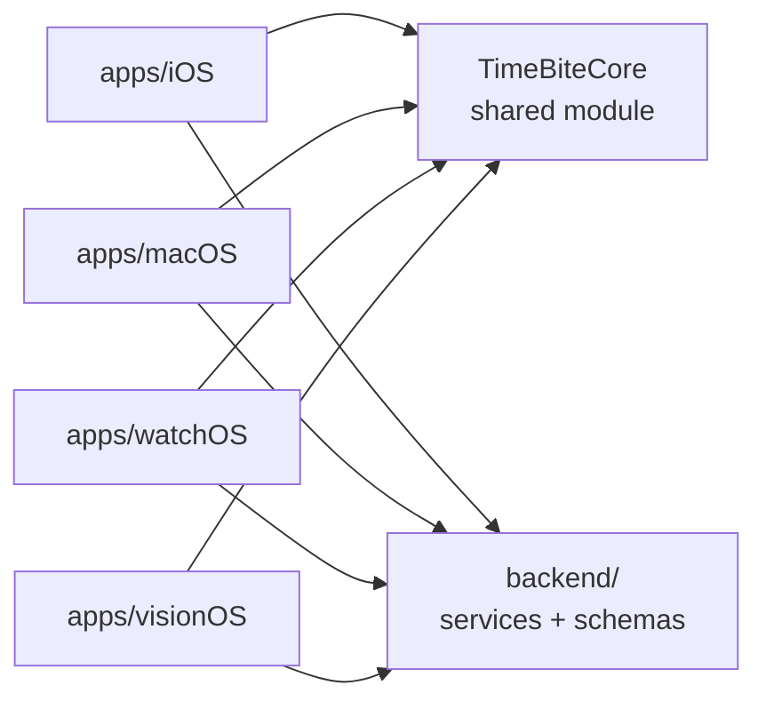

# TimeBite Repository and Product Architecture

Last updated: August 17, 2026.

> **This document was rewritten on August 17, 2026.** It previously described a
> multi-repository split (separate `timebite-ios` and `timebite-vision` repos, with
> shared code named `TimeBiteKit`, and the name "TimeBite Core" explicitly forbidden).
> That plan is superseded. TimeBite is consolidating into a single monorepo, and the
> shared module is named **TimeBiteCore**. Older documents and commit messages that
> reference `TimeBiteKit` or a per-platform repo split predate this decision.

## Naming Rules

| Name | What it is |
| --- | --- |
| `timebite-platform` | The monorepo. Everything: all four Apple app targets, the shared module, backend services, schemas, and documentation. |
| `TimeBiteCore` | The shared Swift module consumed by all four app targets. Domain models, progress and Activity Ring calculations, daily summary logic, service protocols, semantic design tokens, and neutral presentation primitives. |
| `timebite-macos` | The standalone macOS repository being migrated into `timebite-platform`. Canonical reference for product behavior and visual direction until migration completes. |

Do not introduce `TimeBiteKit`; it is the superseded name for `TimeBiteCore`. Do
not create separate per-platform application repositories.

## Target Structure

```text
timebite-platform/
├── apps/
│   ├── iOS/                 # iPhone + iPad
│   ├── macOS/               # Migrated from timebite-macos
│   ├── watchOS/             # Paired Watch app
│   └── visionOS/            # Apple Vision Pro
├── Packages/
│   └── TimeBiteCore/        # Shared module consumed by all four targets
├── backend/                 # Services for goals, cycles, assistant, telemetry
├── docs/                    # Product, architecture, roadmap, sprint docs
├── schemas/                 # Shared JSON shapes for goals, tasks, rollups
├── specs/                   # Focused product and platform specifications
├── research/                # Research experiments and outputs
└── README.md
```

`Shared/` at the repository root is the current, pre-packaging location of the
shared code. It becomes `Packages/TimeBiteCore` when the module is formalized.

## Dependency Direction



The flow is one-way:

`Platform UI -> TimeBiteCore presentation -> TimeBiteCore services -> TimeBiteCore domain -> TimeBiteCore models`

`TimeBiteCore` must not depend on any app target, and must not contain
platform-specific behavior.

### What belongs in `TimeBiteCore`

Domain models, validation and derivation logic, progress and Activity Ring
calculations, daily summary logic, AM/PM/Total day-part rules, repository and
storage contracts, formatting helpers, semantic design tokens, and reusable
presentation primitives that genuinely work on all four platforms.

### What stays in an app target

Navigation, windowing and scene management, gestures and input affordances, app
lifecycle, permission flows, and any layout tuned to one platform's conventions.

## macOS Is the Reference Implementation

`timebite-macos` holds the strongest existing implementation of TimeBite's
product behavior and visual direction. Two consequences follow:

1. **macOS migrates in as-is.** `timebite-macos` becomes `apps/macOS/`, retaining
   its workspace shell, navigation, and feature views.
2. **iOS is rebuilt from it.** The existing `apps/iOS` app predates the macOS work
   and has diverged from it. Rather than patching iOS incrementally, a new iOS
   version is built under `apps/iOS` derived from the macOS implementation and
   `TimeBiteCore`, so both platforms express one product.

Rebuilding iOS from macOS does not mean copying macOS layouts onto a phone. It
means sharing domain logic, semantic tokens, and information architecture, while
keeping navigation and layout native to each platform.

## Platform Responsibilities

| Platform | Role |
| --- | --- |
| macOS | Desktop workspace. Information density, resizable layouts, pointer and keyboard interaction. The reference implementation. |
| iOS | iPhone and iPad. Touch, compact responsive layout, native navigation. Rebuilt from the macOS implementation. |
| watchOS | Glance-first. Activity Rings, current progress, AM/PM/Daily summary, minimal Actions detail. Not a miniature desktop app. |
| visionOS | Conventional SwiftUI window first. Rings, Actions, and daily summary in a readable native presentation. Spatial and immersive work is deferred until justified. |

## Consolidation Order

1. Establish shared domain, ring calculations, and semantic design tokens under
   `Shared/`. *(Done — see `docs/cross-platform-slice-handoff.md`.)*
2. Prove the shared layer compiles by consuming it from the existing iOS target.
3. Add macOS, watchOS, and visionOS targets against the shared layer.
4. Migrate `timebite-macos` into `apps/macOS/`.
5. Formalize `Shared/` as `Packages/TimeBiteCore`.
6. Rebuild `apps/iOS` from the macOS implementation on top of `TimeBiteCore`.
7. Decide the fate of the standalone `timebite-macos` repository (archive or retain).

## Related Repositories

| Repository | Status | Responsibility |
| --- | --- | --- |
| [`erinjerri/timebite-platform`](https://github.com/erinjerri/timebite-platform) | Canonical | The monorepo. All Apple app targets, `TimeBiteCore`, backend, schemas, docs. |
| [`erinjerri/timebite-macos`](https://github.com/erinjerri/timebite-macos) | Migrating in | Standalone macOS app. Reference implementation until it lands in `apps/macOS/`. |
| [`erinjerri/cyra-vision`](https://github.com/erinjerri/cyra-vision) | Separate product | CYRA planner and Vision Board capture. Distinct product identity from TimeBite; may share a versioned planning exchange format. |
| [`erinjerri/cyra-site`](https://github.com/erinjerri/cyra-site) | Canonical website | Public site. |
| [`erinjerri/timebite-torus-agentbeats`](https://github.com/erinjerri/timebite-torus-agentbeats) | Archive/reference | Hackathon and demo work; not a production dependency. |

## Finance Unlock Prompt Audit

Retained from the previous revision of this document.

The progressive Finance prompt was partially implemented, but not as the
requested reusable unlock system. Commit `17da20e` added the Stage 2 headline
and checking-account copy inside `PlaidConnectModal`, embedded in
`apps/iOS/TimeBite/Features/Finance/FinanceDashboardView.swift`.
`FinanceUnlockStage`, `FinanceUnlockModal`, `FinanceUnlockManager`, and
`FinanceUnlockViewModel` do not exist, and neither do Stages 3 and 4 or their
configurable rule engine. Commit `cd45f29` later added live Plaid LinkKit and
backend synchronization despite the original prompt saying not to implement
Plaid yet.

There is no repository or Notion evidence that the prompt ran a
self-improving-AI process. The implementation history shows normal feature
commits, not prompt evaluation or a recorded self-improvement loop.
