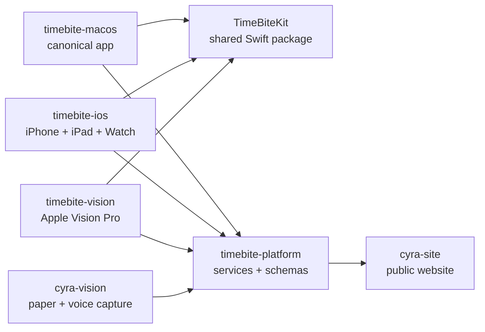

# CYRA and TimeBite Repository Architecture

Last updated: July 26, 2026.

## Naming Rule

`timebite-macos` is the canonical or "core" TimeBite application.

Do not use "TimeBite Core" to describe `timebite-platform`. Do not create a
`timebite-core` application repository. If shared Swift code needs an
independent package after two clients consume it, call that package
`TimeBiteKit`.

## Repository Ownership

| Repository | Status | Canonical responsibility |
| --- | --- | --- |
| [`erinjerri/timebite-macos`](https://github.com/erinjerri/timebite-macos) | Existing; architecture/design handoff in progress | Canonical macOS TimeBite application and reference implementation for product behavior |
| [`erinjerri/timebite-platform`](https://github.com/erinjerri/timebite-platform) | Existing; transition repository | Backend services, schemas, sync, integrations, AI/agent services, and existing client code while it is extracted |
| `erinjerri/timebite-ios` | Create after the macOS baseline is stable | iPhone and iPad application; owns the paired watchOS app and WidgetKit extension |
| `erinjerri/timebite-vision` | Create after shared contracts stabilize | Apple Vision Pro application; spatial execution, drag and drop, and computer-vision-assisted capture |
| `TimeBiteKit` | Begin as a package inside `timebite-macos`; extract only when needed | Shared domain models, JSON contracts, timer state machine, progress-ring calculations, import/export, and service protocols |
| [`erinjerri/cyra-vision`](https://github.com/erinjerri/cyra-vision) | Existing | CYRA physical paper planner and Vision Board capture application; OCR, VisionKit, speech-to-text, review, and structured planner export |
| [`erinjerri/cyra-site`](https://github.com/erinjerri/cyra-site) | Existing; canonical website | CYRA website built from the CYRA website template, Neuform UI, and the Payload CMS backend patterns from `erinjerri-portf-template` |
| [`erinjerri/erinjerri-portf-template`](https://github.com/erinjerri/erinjerri-portf-template) | Upstream/template; local checkout needs repair | Reusable Payload CMS backend and portfolio-site patterns consumed by `cyra-site` |
| [`erinjerri/timebite-torus-agentbeats`](https://github.com/erinjerri/timebite-torus-agentbeats) | Existing; archive/reference | Hackathon and demo work; not a production dependency |
| [`erinjerri/cyra-marketing-site`](https://github.com/erinjerri/cyra-marketing-site) | Legacy/reference | Previous marketing-site implementation; not the canonical website going forward |

## Product and Code Boundaries

### `timebite-macos`

The macOS app is the source implementation for the complete TimeBite
experience:

- planning and daily intent
- goal and task editing
- day-part allocation
- reverse-Pomodoro timer behavior
- two-ring progress model
- reflection, review, and analytics
- desktop import, drag and drop, and operator workflows

Build and validate features here first when they benefit from the full desktop
workspace. Extract reusable behavior into `TimeBiteKit`; do not make the iOS or
visionOS apps depend directly on macOS UI code.

#### Initial macOS baseline artifacts

The first product-definition handoff into `timebite-macos` consists of:

- the initial macOS system architecture document
- the initial macOS design Markdown
- the lo-fi macOS wireframe

These artifacts establish the source baseline for implementation sequencing,
screen ownership, shared-component extraction, and later iOS/watchOS/visionOS
adaptation.

As verified on July 26, 2026, the public `main` branch and the local clone still
show only `.gitignore` and `README.md`. Treat the handoff as pending until the
three artifacts are committed, pushed, and linked from the
`timebite-macos/README.md`. Do not duplicate or rewrite them in
`timebite-platform`; this repository should link to the macOS originals.

Recommended organization:

```text
timebite-macos/
├── README.md
├── docs/
│   ├── system-architecture.md
│   ├── design.md
│   └── wireframes/
│       └── macos-lo-fi.*
└── TimeBiteMac/
```

### `timebite-platform`

This repository owns capabilities shared through APIs and data contracts:

- FastAPI and other backend services
- authentication and sync
- canonical JSON schemas
- Plaid and other external-service adapters
- AI/agent orchestration, retrieval, and telemetry
- migration tooling and compatibility fixtures
- existing iOS, macOS, and visionOS code until each client is moved

It is a platform repository, not the canonical client application.

### `timebite-ios` and watchOS

The iOS repository will own both the iPhone/iPad app and its paired Watch app.
Keep watchOS in the same repository because signing, companion bundle
configuration, Watch Connectivity, widgets, and releases are coupled.

The Watch experience includes:

- swipeable parts of the day
- two progress rings for each day part
- the live reverse-Pomodoro countdown
- start, pause, resume, complete, and reflection handoff
- WidgetKit complications and Smart Stack surfaces
- compact snapshots and event deltas synchronized with the phone

### `timebite-vision`

The visionOS client is the most spatially ambitious TimeBite surface:

- spatial day-part and ring views
- live timer and reflection
- drag-and-drop planning
- image, document, and environment-assisted capture
- computer-vision-assisted input
- future ambient interaction experiments

It is Apple Vision Pro first. Future Apple AI glasses can share its interaction
contracts. Other glasses platforms should receive separate adapters when a
second platform and SDK are real; do not force non-Apple code into the
visionOS application target.

### `cyra-vision`

CYRA Vision remains distinct from TimeBite Vision:

- `cyra-vision` digitizes physical CYRA planner and Vision Board input.
- `timebite-vision` is the Apple Vision Pro TimeBite execution client.

Both may produce or consume the same versioned planning exchange format, but
they retain separate product identity, navigation, stores, and release plans.

### `cyra-site`

`cyra-site` is the canonical public website repository. It combines:

- the existing CYRA website template
- Neuform UI
- Payload CMS backend patterns from `erinjerri-portf-template`

Cross-product public documentation belongs here after the architecture is
stable. Internal implementation details and operator links stay in Notion and
repository documentation.

The local `erinjerri-portf-template` directory is not currently an isolated
checkout: Git resolves its top level to the parent `GH-Repos-Main` directory.
Its configured origin is the expected GitHub URL, but the connected GitHub app
cannot currently resolve that repository. Repair or freshly clone this
template before importing it into `cyra-site`.

## Data and Dependency Direction



Clients depend on `TimeBiteKit` and platform contracts. `TimeBiteKit` must not
depend on app UI targets.

## Consolidation Order

1. Commit and push the macOS system architecture, design Markdown, and lo-fi
   wireframe into `timebite-macos/docs/`.
2. Link all three baseline artifacts from `timebite-macos/README.md`.
3. Reconcile the architecture, design, and wireframe into one implementation
   checklist; record conflicts explicitly instead of choosing silently.
4. Establish a clean, buildable `timebite-macos` Xcode baseline.
5. Inventory features in `timebite-platform` as move, share, retain, or archive.
6. Move canonical desktop product behavior to `timebite-macos`.
7. Create `Packages/TimeBiteKit` inside `timebite-macos`.
8. Extract domain values, JSON contracts, timer logic, and ring calculations.
9. Keep backend, Plaid, sync, and agent services in `timebite-platform`.
10. Create `timebite-ios` and include the paired watchOS targets.
11. Consume `TimeBiteKit` from iPhone, iPad, and Watch.
12. Create `timebite-vision` after the shared contracts pass on macOS and iOS.
13. Repair or freshly clone `erinjerri-portf-template` as an isolated
    repository before merging its Payload CMS patterns.
14. Update `cyra-site` with the public product ecosystem; keep the internal
    operating map in Notion.

## Finance Unlock Prompt Audit

The progressive Finance prompt was partially implemented, but it was not
implemented as the requested reusable unlock system.

Evidence:

- Commit `17da20e` added the exact Stage 2 headline, "Make your plan automatic,"
  and checking-account copy inside `PlaidConnectModal`.
- The implementation is embedded in
  `apps/iOS/TimeBite/Features/Finance/FinanceDashboardView.swift`.
- `FinanceUnlockStage`, `FinanceUnlockModal`, `FinanceUnlockManager`, and
  `FinanceUnlockViewModel` do not exist.
- Stages 3 and 4 and their configurable rule engine do not exist.
- Commit `cd45f29` later added live Plaid LinkKit and backend synchronization,
  despite the original prompt saying not to implement Plaid yet.

There is no repository or Notion evidence that the prompt itself ran a
self-improving-AI process. It reads and behaves as a feature specification.
The implementation history shows normal feature commits, not prompt
evaluation, recursive improvement, automatic rule tuning, or a recorded
self-improvement loop.
