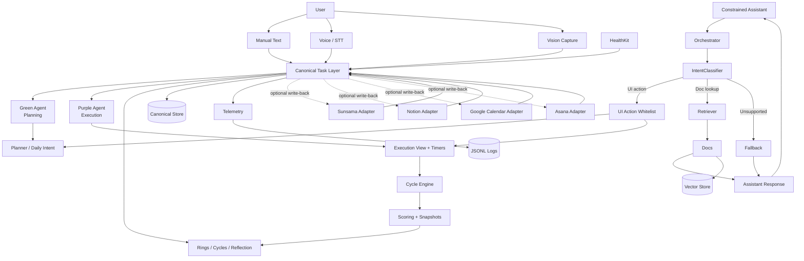

# System architecture

High-level flow for the TimeBite platform: ingestion, canonical tasks, integrations, agents, UI surfaces, and telemetry.

---

## Information architecture

---

## Legend

| Symbol | Meaning |
| ------ | ------- |
| **Canonical Task Layer** | Source of truth that normalizes all inputs and integrations |
| **Green / Purple** | Planning vs execution paths that operate on canonical tasks |
| **Adapters** | Integration boundaries for Sunsama, Notion, Calendar, and Asana |
| **Orchestrator** | Routes assistant intents to UI whitelist, retrieval, or fallback |
| **Telemetry** | Structured logs for replay and debugging |

If the diagram does not render, use a viewer that supports [Mermaid](https://mermaid.js.org/) (GitHub renders it in fenced `mermaid` blocks).
