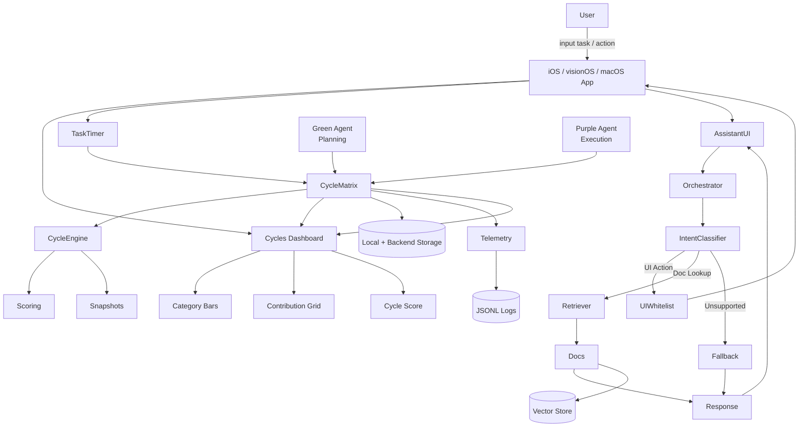

# System architecture

High-level flow for the TimeBite client: cycle matrix, UI surfaces, constrained assistant, and telemetry.

---

## Data flow

---

## Legend

| Symbol | Meaning |
| ------ | ------- |
| **Cycle Matrix** | Backend source of truth for time × category allocation |
| **Green / Purple** | Planning vs execution paths into the matrix |
| **Orchestrator** | Routes assistant intents to UI whitelist, retrieval, or fallback |
| **Telemetry** | Structured logs for replay and debugging |

If the diagram does not render, use a viewer that supports [Mermaid](https://mermaid.js.org/) (GitHub renders it in fenced `mermaid` blocks).
