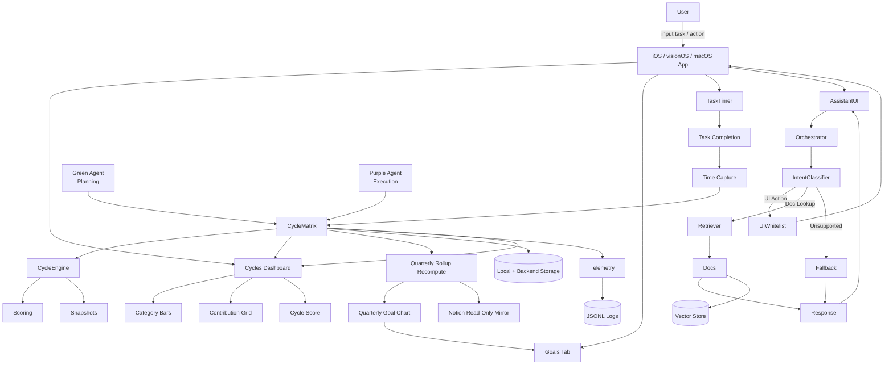

# System architecture

High-level flow for the TimeBite client: cycle matrix, goal rollups, UI surfaces, constrained assistant, and telemetry.

---

## Data flow



---

## Quarterly rollup flow

The Quarterly Goal Chart is derived from completed task time, not from client-submitted progress.

```text
task completion
  -> time capture
  -> Cycle Matrix update
  -> quarterly rollup recompute
  -> Goals tab chart
  -> Notion read-only mirror
```

When a task is completed, TimeBite captures the actual `time_spent_minutes` when available, falling back to the planned `time_allotted_minutes`. That time is written into the Cycle Matrix using the completion time segment as the row and the goal's category as the column. The backend then recomputes the parent goal's quarterly rollup.

`percent_complete` is never accepted from the client. It is server-computed from rollup math:

```text
logged_minutes = sum(completed child task minutes)
percent_complete = logged_minutes / target_minutes
```

Notion consumes the recomputed rollup as a read-only mirror. TimeBite remains write-primary: app and backend state are authoritative, while Notion reflects the result for planning and review.

---

## Legend

| Symbol | Meaning |
| ------ | ------- |
| **Cycle Matrix** | Backend source of truth for time × category allocation |
| **Quarterly Rollup** | Server-computed goal progress payload for the Goals tab chart |
| **Notion Mirror** | Read-only consumer of rollups; never the write source |
| **Green / Purple** | Planning vs execution paths into the matrix |
| **Orchestrator** | Routes assistant intents to UI whitelist, retrieval, or fallback |
| **Telemetry** | Structured logs for replay and debugging |

If the diagram does not render, use a viewer that supports [Mermaid](https://mermaid.js.org/) (GitHub renders it in fenced `mermaid` blocks).
