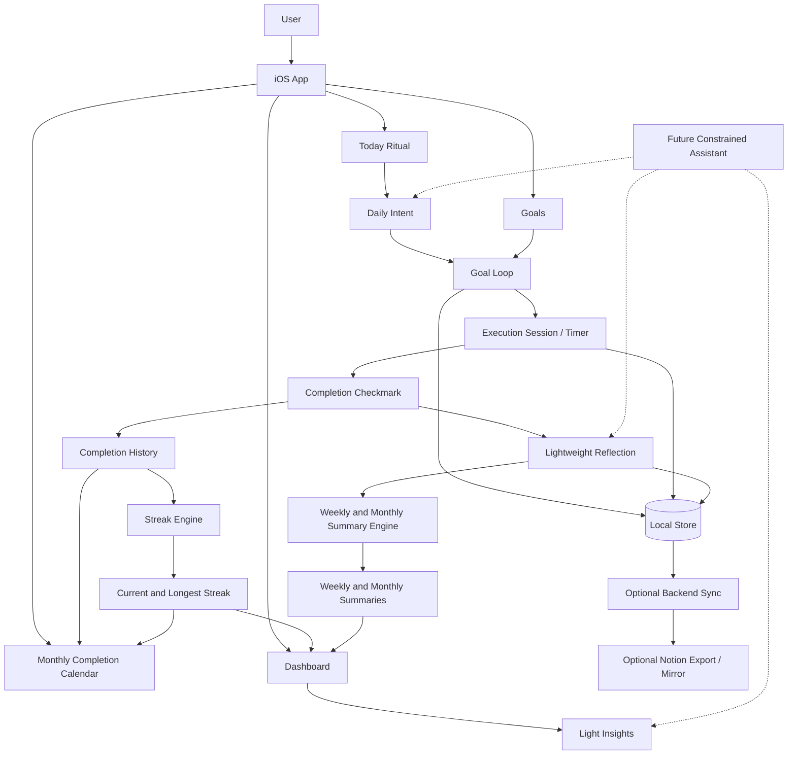

# System Architecture

TimeBite is pivoting from an analytics-first cycle matrix toward a calm Goal Loop architecture:

```text
Goal Loop -> Execution -> Reflection -> Streak -> Insights
```

Analytics still matter, but they are derived from lived goal activity rather than driving the primary user experience.

---

## Data Flow



---

## Authoritative Objects

### Goal

The Goal is the durable product object. It owns intent, category, frequency, sessions, completion history, reflections, current streak, longest streak, weekly summary, monthly summary, and tags.

### Session

A Session is an execution attempt tied to a goal. It records planned duration, actual duration, timer state, completion state, and timestamps.

### Completion History

Completion history is the source for checkmarks, streaks, and monthly calendar cells. Clients should not submit computed streak values as truth; they should submit completion events.

### Reflection

A Reflection is short user-authored text, mood, or prompt response tied to a goal and optionally to a session.

### Insight

An Insight is a derived summary. Insights should be explainable from goal, session, completion, and reflection data.

---

## Loop Rules

- Daily Intent is the preferred entry point.
- Completing a session writes a completion event before updating streak displays.
- Reflection is encouraged after completion but must not block completion.
- Streaks are reinforcement, not punishment; skipped days and rest days need explicit product treatment.
- Dashboard and analytics are read-only summaries over Goal Loop state.
- AI features remain gated and should never be required for the core ritual.

---

## Notion Export Position

Notion is no longer a quarterly rollup source of truth. If enabled, it mirrors:

- active goals
- daily intents
- completed sessions
- weekly summaries
- monthly summaries
- selected reflections if the user opts in

TimeBite remains write-primary.

---

## Legacy Mapping

| Previous concept | New role |
| --- | --- |
| Cycle Matrix | Optional analytics projection over sessions and completions |
| Cycles Dashboard | Dashboard summary and insights layer |
| Quarterly Goal Chart | Deprioritized; replaced by Goal Loop progress and monthly completion calendar |
| Cycle Score | Deprioritized; replaced by streak, completion, and reflection summaries |
| Agent planning | Future gated AI layer after MVP loop proves useful |

---

## Architecture Priorities

1. Goal Loop domain model
2. Daily Intent and Today flow
3. Timer-backed execution sessions
4. Reflection capture
5. Streak engine and completion calendar
6. Calm dashboard summaries
7. Analytics projections
8. AI assistance

---

## P7 Actions, Labels, Deadlines, and HealthKit Boundary

The source diagram is [`TimeBite_System_Architecture.mermaid`](./TimeBite_System_Architecture.mermaid).

- `TaskSvc` owns `elapsed_minutes` and `percent_complete`; Actions renders those server values.
- `RollupSvc` owns daily time-by-Work-Label totals and Goal time-complete totals.
- Work Labels are user-defined project tags for Actions and Track. Goal Life Areas are a separate taxonomy and never share a field.
- Goal deadlines preserve whether a user chose date-only or date+time semantics.
- HealthKit is read-only, enters through `GoalSvc`, and can affect only `Fitness/Health` goals. Events use `tagged_by = "healthkit_bridge"` and never write Tasks.
- TimeBite remains write-primary. Notion remains a one-way read-only mirror.
- Phase 4 assistant/RAG, CYR Studio surfaces, and coach-program Fitness integration remain out of scope.
